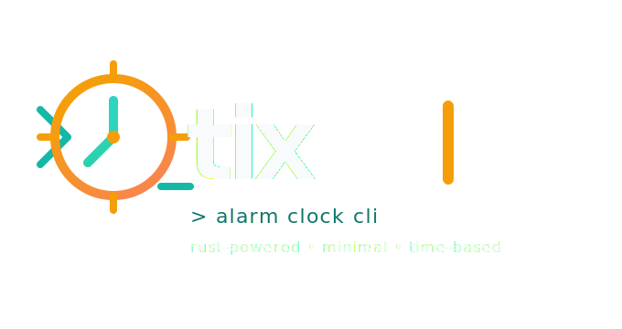

# tix

🕞 tix is a small rust alarm and timer cli.

<p align="center">
  
</p>

you can use it for:
- relative timers like `tix 10m`
- absolute alarms like `tix 12.03.2026 13:30`
- time-only alarms like `tix 13:30` or `tix 01:30pm`
- multiple background alarms at the same time
- foreground mode with a live clock/countdown view

## install

from crates.io:

```bash
cargo install tix
```

from this repo:

```bash
cargo install --path .
```

## quick use

schedule a background alarm:

```bash
tix 10m
```

run in foreground:

```bash
tix -f 10m
```

force background mode:

```bash
tix -b 10m
```

check active alarms:

```bash
tix status
```

stop one alarm:

```bash
tix stop <id>
```

stop all alarms:

```bash
tix stop --all
```

show or change volume:

```bash
tix volume
tix volume 0.3
tix volume test
```

## config

the config file lives here:

```text
~/.config/tix/config.toml
```

example:

```toml
timezone = "europe/berlin"
date_order = "dmy"
time_notation = "24h"
default_mode = "background"
auto_stop_seconds = 0
volume = 0.3
sound_file = "/home/ax/music/3.mp3"

[foreground]
refresh_interval_ms = 250
show_current_datetime = true
show_target_datetime = true
show_remaining = true
show_input = true
timer_style = "digital"
```

## notes

- cli flags override the default mode from config
- `auto_stop_seconds = 0` means the alarm keeps ringing until you stop it
- if custom audio fails, tix falls back to the built-in tone or terminal bell
